# SalesSense

[](https://sales-sense-ai-4yhu.onrender.com)
[](https://sales-sense-ai-4yhu.onrender.com)

**Live Demo URL:** [https://sales-sense-ai-4yhu.onrender.com](https://sales-sense-ai-4yhu.onrender.com)

## Problem Statement
Traditional inventory management systems struggle to predict consumer demand fluctuations, resulting in expensive stockouts or wasteful capital tied up in excess inventory. SalesSense addresses this by combining advanced machine learning forecasts with a dynamic, safety-stock-driven inventory optimization workflow to streamline operations.

## End-to-End Workflow

This flowchart outlines how raw transaction data is ingested, processed, modeled, and transformed into actionable inventory optimization choices and live dashboard statuses:

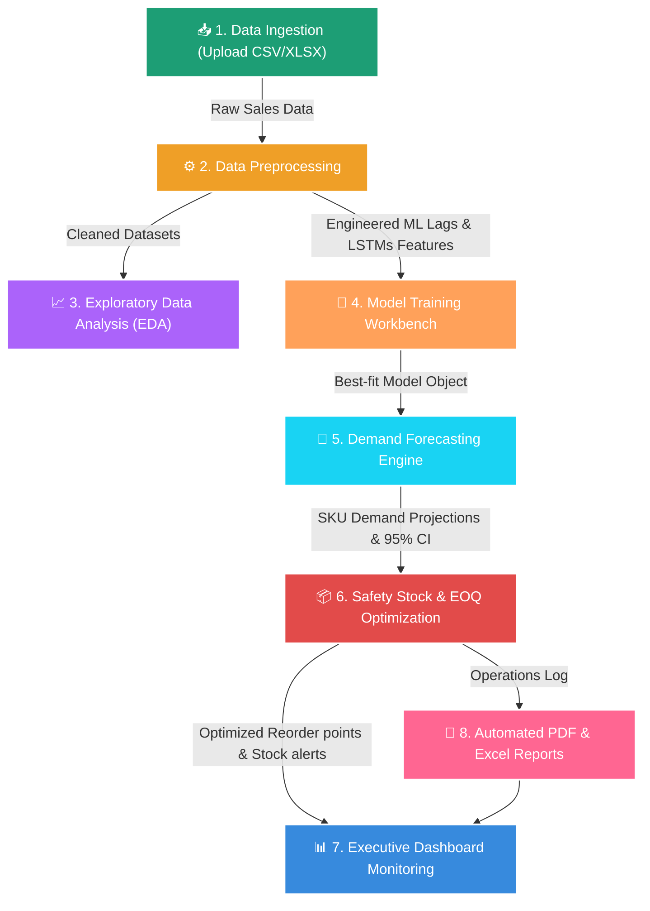

## Features
- **Dashboard**: Real-time business overview with high-level KPI cards, interactive sales trends, category distribution charts, and recent operational alerts.
- **Data Upload**: Seamless CSV/XLSX file ingestion with column mapping detection, comprehensive validation reporting, and data type checks.
- **Data Preprocessing**: Interactive multi-step wizard for handling missing values, identifying/capping outliers via the IQR method, automating feature engineering (lag, rolling, calendar, holiday indicators), and normalization.
- **EDA Analysis**: In-depth exploratory data analysis including summary stats, monthly trend breakdowns, correlation heatmaps, top-revenue SKUs, and year-over-year sales performance.
- **Model Training**: Custom machine learning pipeline featuring ARIMA, SARIMA, Prophet, XGBoost, Random Forest, and Deep Learning (LSTM-based) architectures, complete with hyperparameter tuning, model comparison charts, and metrics (MAPE, RMSE, MAE, R²).
- **Sales Forecasting**: Interactive future projection charts showing 95% confidence intervals, category forecasts, SKU-level filtering, and CSV download capabilities.
- **Inventory Optimization**: Automatic calculations for safety stock, reorder points, economic order quantity (EOQ), and days of stock remaining with color-coded warning systems and carrying cost savings logs.
- **Reports**: Quick one-click automated summaries exported as professionally styled PDF (via `fpdf2`) and Excel (via `openpyxl`) spreadsheets.

## Tech Stack

| Component | Technology |
|---|---|
| Frontend / App framework | Streamlit |
| Data Manipulation | Pandas, Numpy |
| Machine Learning Models | Scikit-learn, XGBoost, Prophet, Statsmodels |
| Data Visualisation | Plotly |
| Export Formats | openpyxl (Excel), fpdf2 (PDF) |
| Holidays Integration | holidays |

## Setup Instructions

1. **Clone the repository**:
   ```bash
   git clone https://github.com/yourusername/sales-sense-ai.git
   cd sales-sense-ai
   ```

2. **Install dependencies**:
   ```bash
   pip install -r requirements.txt
   ```

3. **Run the application**:
   ```bash
   streamlit run app.py
   ```

## Folder Structure

```text
sales-sense-ai/
├── app.py                          # Main Streamlit entry point
├── requirements.txt
├── README.md
├── data/
│   └── sample_sales_data.csv       # Preloaded realistic sample data
├── modules/
│   ├── __init__.py
│   ├── dashboard.py
│   ├── data_upload.py
│   ├── preprocessing.py
│   ├── eda.py
│   ├── model_training.py
│   ├── forecasting.py
│   ├── inventory.py
│   └── reports.py
├── models/
│   └── __init__.py
├── utils/
│   ├── __init__.py
│   ├── data_utils.py
│   └── plot_utils.py
└── assets/
    └── style.css
```

## Project Screenshots

### 1. Dashboard Overview
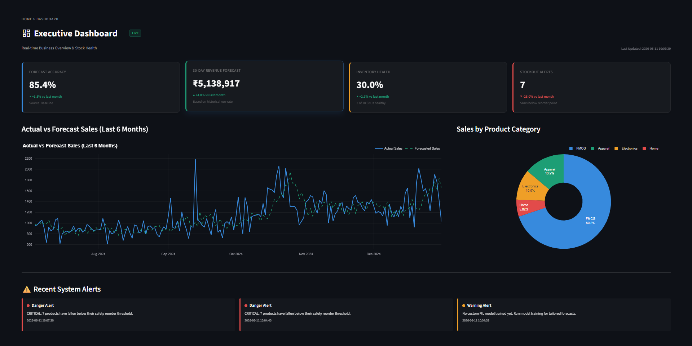

### 2. Data Upload Module
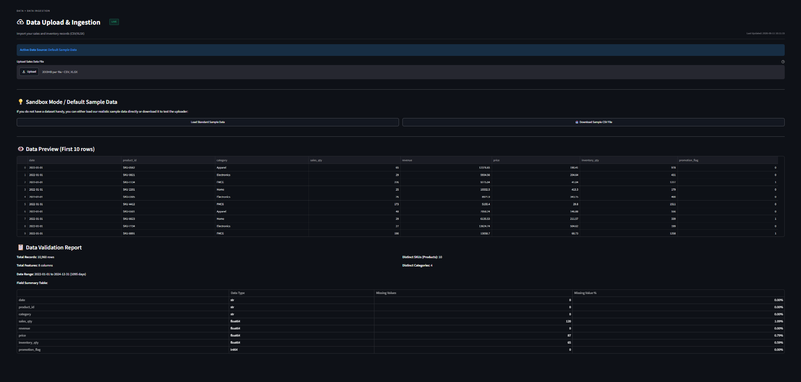

### 3. Data Preprocessing
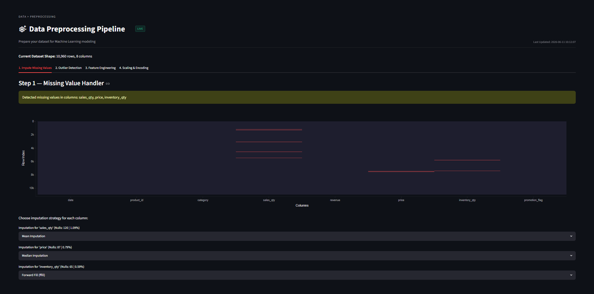

### 4. Exploratory Data Analysis
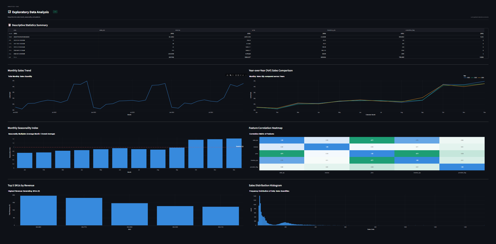

### 5. Model Training Results
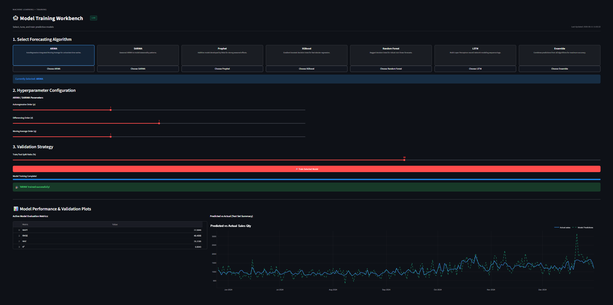

### 6. Sales Forecasting
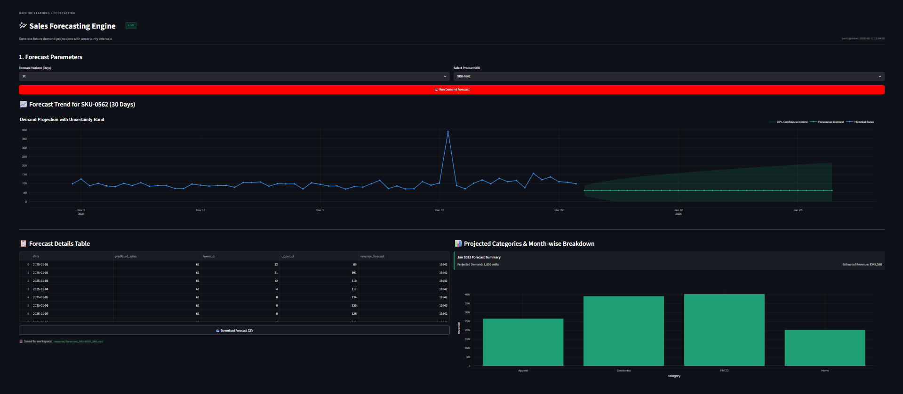

### 7. Inventory Optimization
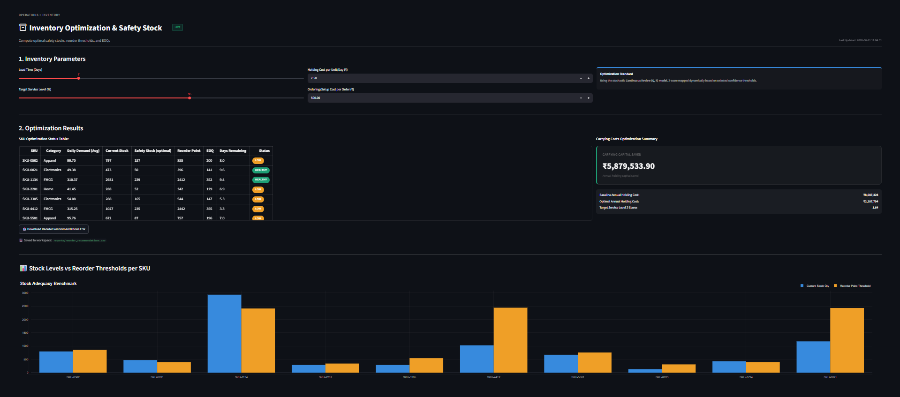

### 8. Report Export
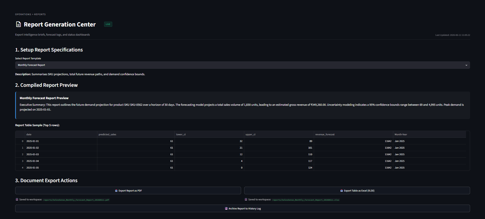

### 9. Forecast PDF Report
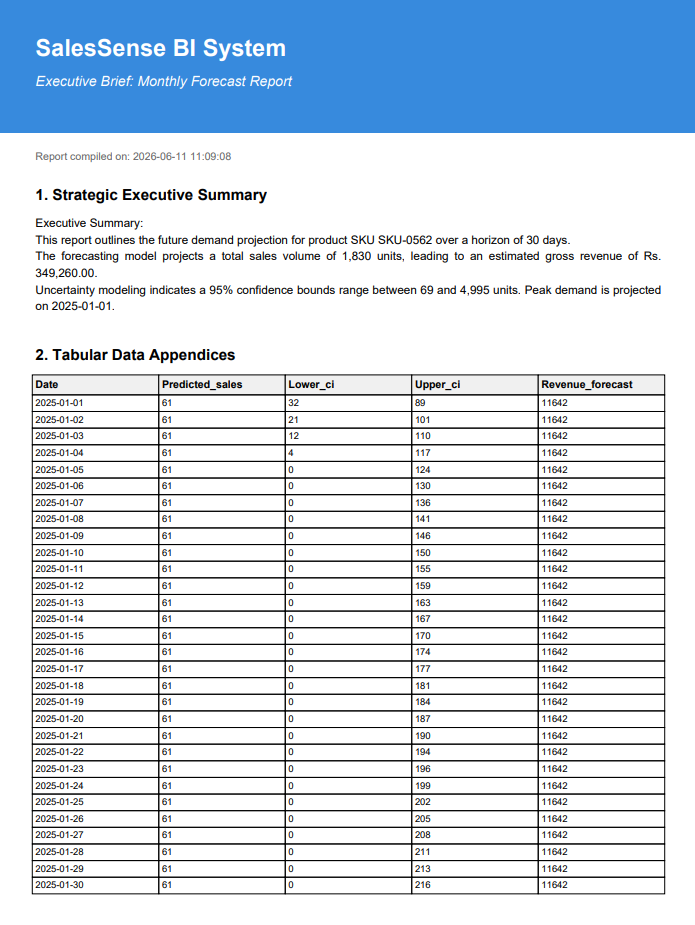

### 10. Forecast Excel Report
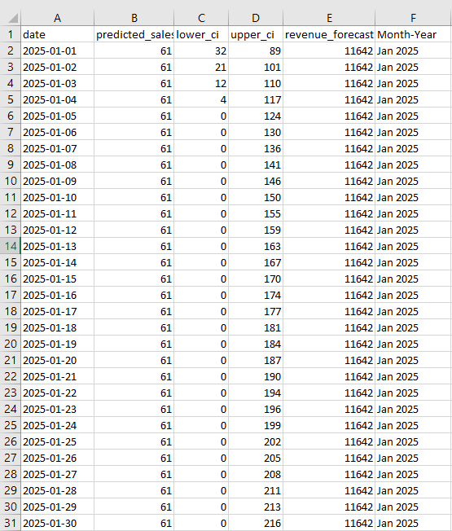

## License
MIT License
